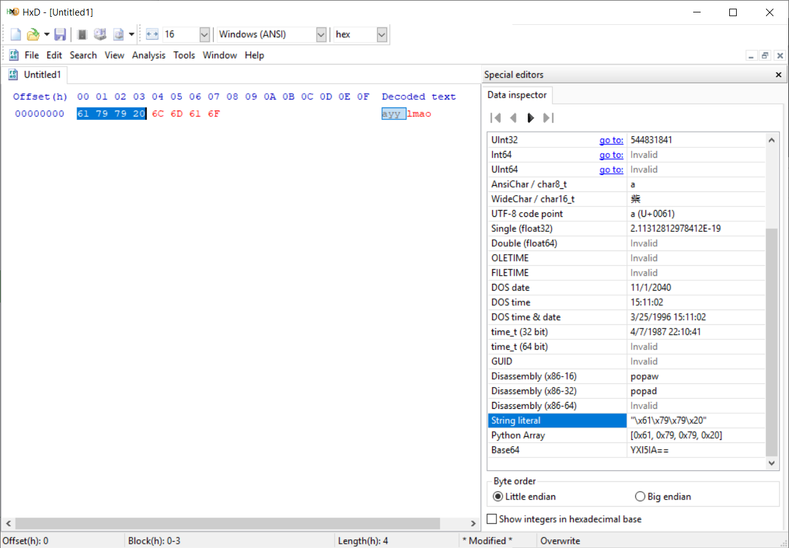

# HxD plugin for useful conversions

A screenshot for my favorite hex editor, [HxD](https://mh-nexus.de/en/hxd/).

## Features

 - Copy as string literal `"\x12\x34\x56\x78"`
 - Copy as Python array `[0x12, 0x34, 0x56, 0x78]`
 - To/from Base64

Based off the [example](https://github.com/maelh/hxd-plugin-framework) by the HxD author

Unfortunately, the selection size is limited to 0x1000 for performance reasons.

# Installation

Download from releases and add to `C:\Program Files\HxD\Plugins`. Create the folder if it doesn't already exist

## Requirements

This is only supported on HxD 2.4.0.0 but it will still work on other versions.

# Compiling

Compile the solution in `Examples\C++` with VS2019
